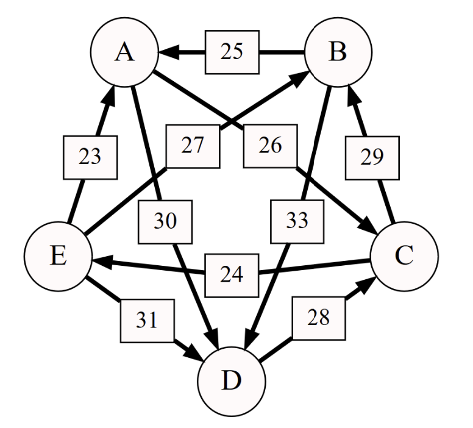

# Blockchain dev related questions

## 1) Blockchain consensus
What is:
- Proof-of-Work?  
- Proof-of-Stake?  
- Proof-of-Authority?  
- Proof-of-X? (with X being a consensus mechanism not previously explained)  

- **to do**  
- **to do**  
- **to do**  
- **to do**  

## 2) Hashes
In a blockchain system, in the first step party A must commit to n values X={x_1,x_2,...,x_n}.  
Note that it is important that the values can’t be known by a blockchain observer before party A reveals them.  
To do so we define the hash chain as y_1=x_1 and y_n=hash(x_n,y_{n-1}) for n=2,...,n.
Where hash is a cryptographic hash function with the following properties:
Preimage resistance (From a value b, it is computationally impossible to find a, such that hash(a)=b).
Collision resistance (It is computationally impossible to find a_1 and a_2 such that hash(a_1)=hash(a_2)).  

In a first step party A sends a transaction containing y_n.  
In the second step, party A reveals one of these values.  Note that at this point, it is not a problem if some observer knows the values revealed.  

What is the computational complexity of the reveal operation:  
- For party A?  
- For every fullnode of the blockchain (this is linked to gas consumption)?  

- **to do**  
- **to do**  

Can we use another data structure to reduce the computational complexity for every fullnode (when you want to reveal just 1 value), without increasing the complexity of the commit operation? If it is, what is this data structure and what would be the resulting complexity?  

**to do**  

Assuming that n=5 and x_i in {0,1}. Is it possible for an external observer to determine X from y_5 in the first step? If it is, how can we change the scheme to prevent it?  

## 3) Graph and off chain computation
The widest path problem is the problem of finding a path between two designated vertices in a weighted graph, maximizing the weight of the minimum-weight edge in the path. (Wikipedia)  

    

  

In this graph, what is the widest path from E to A and what is its value?  

**to do**  

We have a graph with n vertices and m edges (with m>=n). We have multiple parties each having unlimited computational power, but the amount of operations we can do on the blockchain is limited (particularly due to gas cost and gas limit).  

We want to have the value of the widest path between two nodes, but we don’t want to compute it on the blockchain.  
Design a mechanism to have the widest path and its value on the blockchain while maintaining on chain computation cost as low as possible.  
We will assume there is at least one honest party which wants the result to be the widest path (but don’t assume the chain knows who is this honest party).  

**to do**  

What is the computational complexity on chain (for 1 party)?  
**to do**

## 4) Game theory
Name a strictly positive number. If you name the number which is the most named by all the candidates you succeed in this question.  

**My answer is 1, because this is the smalleest integer greater than 0**